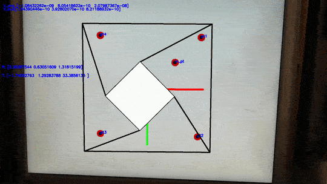
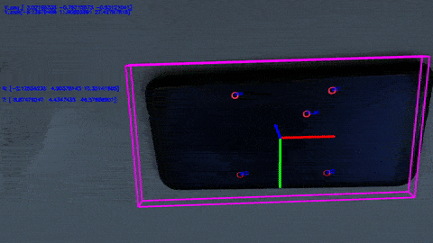
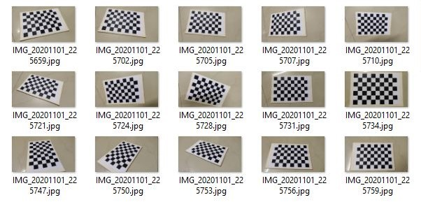
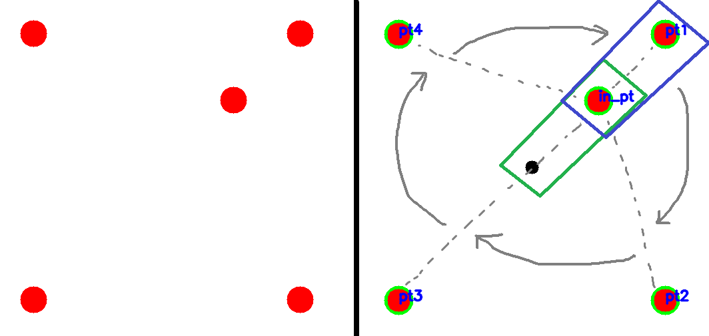
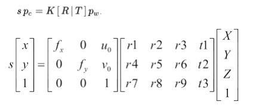

# OpenCV-object-pose-for-emmisive-target
This project is for people who are looking for object pose estimation/augmented reality solutions where reflective fiducial markers are not an option. This method is designed to work for emmisive target elements, such as LEDs or coloured bulbs. I am using red circles to emulate red LEDs since i don't have physical LEDs available on hand. Suffice to say, both will function in a similar manner.  

# Steps required for pose estimation:
1) Obtain and calibrate a camera system. 
2) Create a trackable pattern and store 3d information of the pattern using the physical construction information of the target. 
3) Use camera to track key points and establish a correspondence between the points being tracked and 3D reference points. 
4) Relative position and Orientation (Pose) are obtained by solving the Perspective-N-Point problem.  

# Augmented reality o/p

# Object Pose Reprojection

# Step 1 : Calibrating a camera
Any camera has physical properties of how they represent a point in 3D space in 2D image space. Camera calibration is the process of estimating intrinsic and/or
extrinsic parameters. Intrinsic parameters deal with the camera's internal characteristics, such as, its focal length, skew, distortion, and image centre.The camera will also have some inherent defects,such as barrel or pincushion distortion etc. which are represented in a distortion matrix. We use several images of chessboard to calibrate camera ( zheng method ). ( Print the chessboard pattern on paper and measure the side of a chessboard square to input into the programme ) 

# Step 2 + 3 : Creating trackable pattern, and actually tracking the thing
This is the most tricky part. We will need to create a LED pattern where each LED can be individually detected by using special geometric rules.  **Why do we need to do this** ?  
Beacause there is **absolutely no way** to establish a correspondece beween the LEDs dected in image to the one in the created pattern **without geometric rules**. I have provided one example here, and have included programmes to prototype new patterns (bespoke_led_pattern_gen.py) and develop geometry rules(
geometric_logic.py ) for them.  

a) Detect all LEDs using a colurspace change to HSV and threshold for red. Find the centres for contours and store them in an array. 
b) Calculate a **convex hull** to detect on outer 4 points/LEDs . These will form **pt1,pt2,pt3,pt4** but we **don't know** in which order yet. 
c) The remaining point/LED not part of the convex hull will be **in_pt**. Alternatively, we can find the centre of the convex hull and in_pt will always be the nearest point ( green rectangle ). 
d) The point closest to in_pt is taken as pt1 (blue rectangle) . Then we go **clockwise** and assign other points on the hull in order. This is done by **calculating slopes and barrels shifting** the points according to the values. 
e) **Yay !!** We  have now identified every LEDs perfectly. Try making your own pattern and corresponding geometric rules, it's a little hard to do but hugely satisfing when complete. Just make sure to minimize and rotational ambuigities that might occur :)  

# Step 4 : Perspective-n-point 
Given a set of n 3D points in a world reference frame and their corresponding 2D image projections as well as the calibrated intrinsic camera parameters, we need to determine the 6 DOF pose of the camera in the form of its rotation and translation with respect to the world/target. An inverse of the rotation matrix will in effect, provide the target pose. 
 
